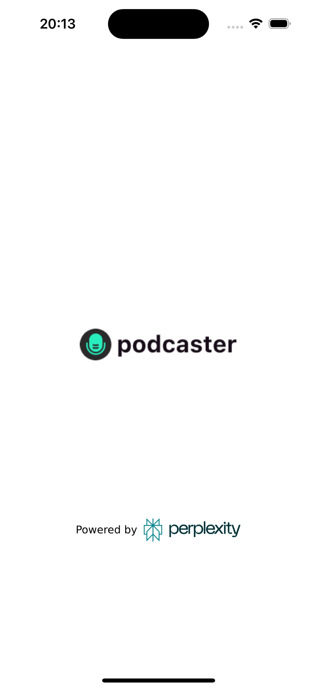
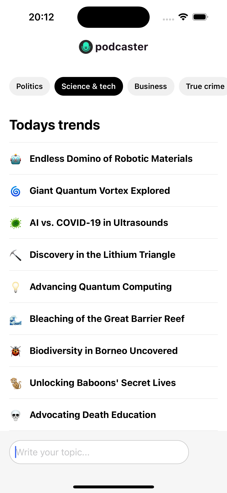
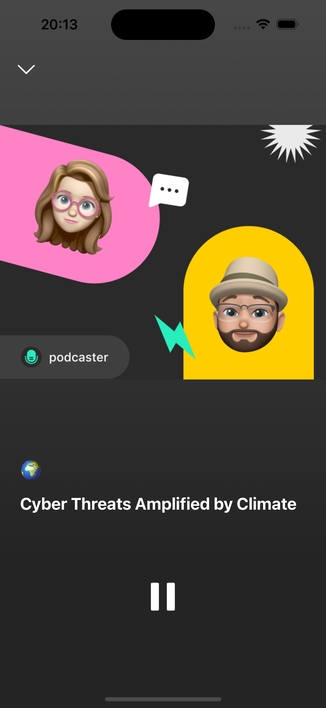
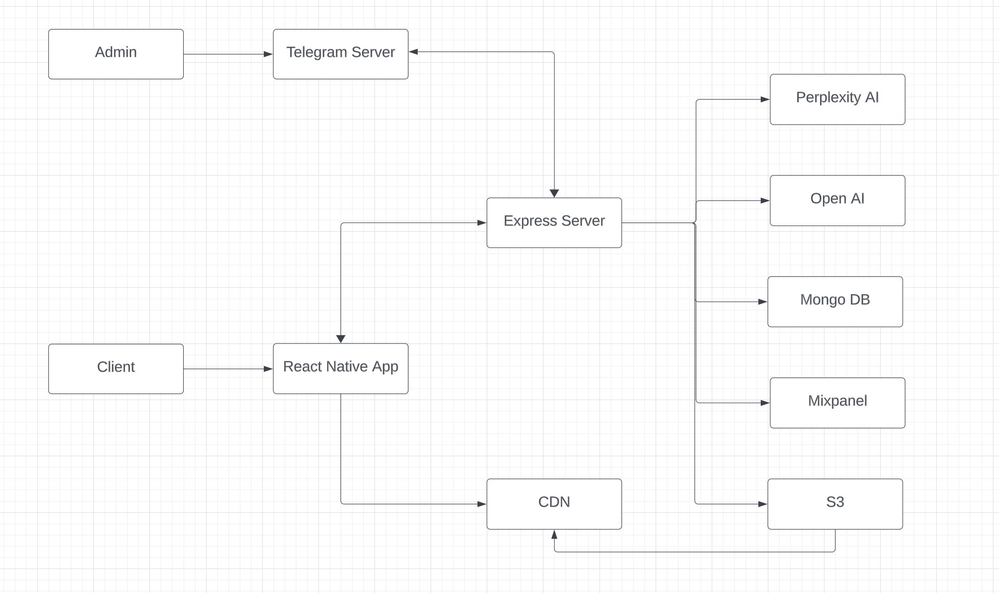

# Podcaster - Real Time Podcasts

## Description

Podcaster creates custom podcasts in real-time on any user-requested topic, in only 5 seconds, using the most advanced AI model from OpenAI, Anthropic AI, and Perplexity AI. It also leverages 7 categories with 10 pre-generated instantly available podcasts, that update/regenerate each 24 hours.

### Review

|  |  |  |
| :---------------------------------------------: | :---------------------------------------: | :---------------------------------------------: |
|               **Loading Screen**                |              **Main Screen**              |               **Podcast Screen**                |

### Video Demo

## Getting Started

### Prerequisites

-   Node.js should be installed on the machine.

### Installation

-   **Backend**: navigate to the “www” folder, install the dependencies (`npm install`)
-   **Frontend**: navigate to the app folder, install the dependencies (`npm install`)

### Environment Variables

#### Backend (/www):

**Required**:

-   `open_ai_token`: OpenAI API key
-   `mongodb_connection_url`: MongoDB connection URL
-   `perplexity_ai_token`: Perplexity API key
-   `PORT`: backend server port
-   `server_url`: URL of the server, including the port
-   `NODE_ENV`: “production” or “dev”
-   `spaces_access_key`: aws-sdk API compatible access key
-   `spaces_secret_access_key`: aws-sdk API compatible secret access key

**Optional**:

-   `labs_api_key`: 11Labs API for better podcast sound capabilities
-   `anthropic_ai_token`: Antropic API key. Sometimes it generates better podcasts than OpenAI, depending on the scenario
-   `dupdub_api_key`: DupDub API key used for animated podcast video generation
-   `cdn_url`: content delivery network URL used to get images of of the podcast co-hosters for video generation

## Usage

Firstly, start the backend server by navigating to “www” folder and running `npm run dev`. Then, start frontend by navigating to “app” folder and running `npm run start`. Once both successfully start, select an environment to run the application: iOS/Android device, web or simulator.

### High-level application diagram:

## Built with

### Frontend:

-   `React Native`: A framework for building native apps using React.\
-   `Expo`: A platform for making universal native apps for Android, iOS, and the web with JavaScript and React.

### Backend:

-   `Node.js`: A JavaScript runtime built on Chrome’s V8 JavaScript engine.\
-   `Express`: A fast, unopinionated, minimalist web framework for Node.js.\
-   `MongoDB`: A NoSQL database designed for modern application developers and for the cloud era.\
-   `Mongoose`: An elegant mongodb object modeling for Node.js.

### Integrations:

-   `OpenAI SDK`: Tools to interact with OpenAI’s APIs.\
-   `Anthropic AI SDK`: SDK for accessing Anthropic’s AI models.\
-   `Perplexity AI`: Tools to interact with Perplexity’s APIs.\
-   `ElevenLabs`: Provides API tools for voice cloning and speech synthesis.\
-   `AWS SDK`: AWS Software Development Kit for access to Amazon Web Services.\
-   `Mixpanel`: Analytics platform to analyze user interactions.\
-   `Telegraf`: Modern Telegram bot framework for Node.js.

## Contact

-   LinkedIn: [www.linkedin.com/in/maksym-bidnyi](https://www.linkedin.com/in/maksym-bidnyi)
-   Email: mbidnyj@gmail.com
